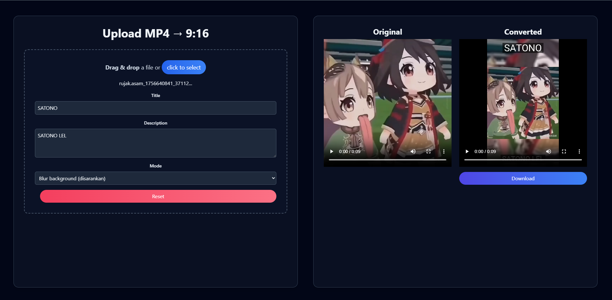

*Tired of your landscape vids looking basic on TikTok and Reels?* 😫 *This app is the ultimate glow-up for your videos, transforming them into vertical masterpieces.* ✨

## **🚀 What's the Vibe?**

*   **Drag & Drop or Nah**: Yeet your MP4 files right into the app or just, you know, click to upload. Easy peasy. 💅
*   **Choose Your Fighter**:
    *   **Blur Background**: The main character video with its own blurred background. Aesthetic AF. 🤌
    *   **Solid Color Pad**: Keep it clean with classic black bars. A whole mood. ⚫
    *   **Center Crop**: Zoom in on the action. No distractions, just vibes. ✂️
*   **Patience is a Virtue (but not for long)**: Real-time progress bars so you know what's up. No more guessing games. ⏳
*   **Looks that Kill**: A super clean, modern UI that's easy on the eyes. We love to see it. 😍
*   **"Thank U, Next" Button**: Messed up? Just hit reset and start over. No drama. ✌️
*   **Slide into Your DMs (Downloads)**: Get a notification when your masterpiece is ready and it'll just start downloading. You're welcome. 📥

## **🛠️ Get it Runnin'**

1.  **Clone the Repo**:
    ```bash
    git clone <repository-url>
    ```
2.  **Slide into the Project Folder**:
    ```bash
    cd video-converter-rotation
    ```
3.  **Install the Goods**:
    ```bash
    npm install
    ```

## **🎬 How to Slay**



1.  **Start the Server**:
    ```bash
    npm start
    ```
2.  **Open Your Browser**: Go to `http://localhost:3000`. You know the drill.
3.  **Drop it Like it's Hot**: Drag and drop your MP4 or click to select it.
4.  **Pick Your Poison**: Choose a conversion mode.
5.  **Hit "Start"**: Let the magic happen.
6.  **Glow-Up Complete**: Your video will auto-download. Go break the internet. 💅